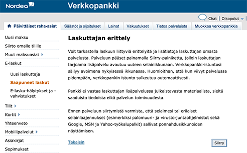
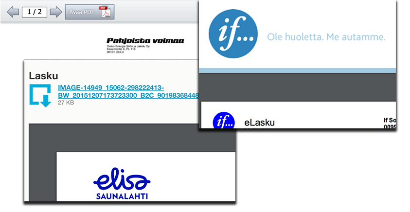

Tuskailin ladatessani e-laskuja omaan arkistooni. Kirjoitan tässä hieman
laajemmin e-laskujen ongelmista ja kehitysmahdollisuuksista. Asia koskee
sinänsä kaikkia pankkeja, mutta kokemukseni perustuvat Nordean palveluun.
Tässä kokemuksiani ja ehdotuksiani tilanteen parantamiseksi.

# Tausta #

Tilaan kaikki laskuni e-laskuna kun mahdollista. Olen asettanut niille
kätevän automaattisen maksaminen ehtojen täyttyessä.

Meillä on vaimoni kanssa yhteisiä laskuja ja yhteinen tapa arkistoida
asiakirjoja, siis myös laskuja. Käymme laskut läpi ja säästämme ne
siltä varalta että myöhemmin tarvii palata asiaan. Erityisesti hyödyt
tulevat vastaan jos laskusta tarvitsee reklamoida.

Tallentamalla PDF-muodossa omalle koneelle vältämme riippuvuuden
pankista. Esimerkiksi asuimme kaksi vuotta Yhdysvalloissa. Lisäksi
PDF-tiedostoihin voi tehdä omia merkintöjä ja kommentteja, mikä ei
onnistu jos laskuja tarkastelee verkkopankin kautta. Verkkopankeilla
on myös rajoituksia kauanko ne säilyttävät vanhoja laskuja ja ylipäätään
laskuja on vaikea hakea muuten kuin saapumisajan mukaan.

# Ongelma #

Nordea listaa saapuneet laskut saapumispäivän mukaan ja näyttää listassa
laskuttajan ja eräpäivän. Tämä on hyvä lähtökohta.

Harmillisesti e-laskujen oikeuksia ei voi hallita kuten tilinhaltijoita.
Eli jos saan laskun,
vaimoni ei pääse sitä katsomaan Nordean verkkopankista ja päinvastoin.
Olen laittanut asiasta ajoittain palautetta, mutta ilmeisesti muilla
ei ole vastaavaa tilannetta että laskut hoidettaisiin yhteisesti.

Asiaan. Mitenkäs laskun voi tallentaa omalle koneelle?
"Laskuttajan erittely" -linkin takaa
löytyy yleensä laskuttajan lähettämä eritelty lasku, minkä haluan siis
talteen. Jos ei, niin "Perustiedot"-linkin takaa löytyy jostain valikosta
mahdollisuus PDF-version tallentamiseen. Erittelylinkkiä klikkaamalla tulee
tällainen näkymä:

Joka laskuttajalla tuntuu olevan omanlaisensa tapa esittää laskun PDF.
Pieni vähemmistö ohjaa suoraan PDF:n. Enemmistöllä PDF on upotettu jollain
tavalla sivulle, tai vielä pahempaa, siitä on vain arkistokelvoton kuva
ja pitää seurata vielä yhtä linkkiä eteenpäin PDF:n saamiseksi. Sivulle
upottamisen ongelma on, että selaimen "tallenna sivu" -ominaisuus tallentaa
upottavan sivun eikä itse PDF-laskua.

Kun tallennan laskun PDF:n koneelle, tiedoston nimeksi tulee yleensä
tekninen nimi:

* BELSFI0012345T_BEL12345678EA6E….pdf
* data.pdf
* download.pdf
* 90191546414.pdf

Joudun käytännössä avaaman tiedostot ja nimeämään ne käsin joka kerta
kun siirrän ne arkistoon. Yhtenäinen nimeäminen olisi kätevää.
Ilmeisesti nimen määrää e-laskun palveluntarjoaja.
E-laskun palveluntarjoaja on siis eri kuin laskuttaja tai minun verkkopankkini,
kuten esimerkiksi Tieto, Enfo tai Basware.

Riippumatta miten hyvä tai huono e-laskun palveluntarjoan toteutus on,
Nordea huonontaa kokemusta vielä yhdellä kerroksella lisää.
Nordean verkkopankki nimittäin ei ymmärrä selaimen välilehtiä,
tai siis tarkemmin sanoen olettaa että niitä ei käytetä. Jos
menit avaamaan linkin välilehdelle, seuraava linkin klikkaus saattaakin
hypätä siihen mitä Nordean mielestä on viimeksi tehty eikä mitä linkkiä
selaimessa painettiin. En tiedä tarkalleen mikä menee pieleen, mutta
joka tapauksessa välilehtiä käyttämällä joutuu väärälle sivulle.
Eli parasta käyttää yhtä ikkunaa. Muuten olisin avannut laskut välilehtiin
ja sulkenut sitä mukaa kun saan tallennettua, jolloin kaikki olisi tullut
hoidettua.

Nyt kun palaan sitten taas listaan kaikista vastaanotetuista e-laskuista,
muistanko vielä viiden laskun tallettamisen jälkeen missä laskussa olin
menossa? Tuskin. Eli koska tallensin laskut jo järjesteltyihin
kansioihin, joudun vertaamaan jo tallennettuja, eri kansioista, pankissa
saapuneiden laskujen listaan. Kohta meni hukkaan.
Pääasiassa tämän vuoksi aikaa tallettamiseen palaa kohtuuttoman kauan.

Sikäli jos merkittävästi parempia palveluita e-laskujen
hoitamiseen on, olen tarvittaessa valmis siirtämään laskujen maksun muuallekin.
Mieluiten keskitän kuitenkin kaiken pankkiasioinnin yhteen paikkaan.

# Ratkaisu / toivelista #

Vaikka saattoi kuulostaa aika negatiiviselta, Suomessa käytössä oleva
e-laskujärjestelmä on sinänsä erinomainen idea ja teknisesti sillä on
potentiaalia olla paljon enemmän. Yhdysvalloissa asuessani jouduin
lataamaan jokaiselta laskuttajalta erikseen PDF:t, sillä pankeilla ei
e-laskuja vastaavaa palvelua ollut. Toisaalta vastapuolena isojen yritysten
kuten PG&E:n ja Comcastin PDF-laskut olivat erinomaisia ja verrattaen
helposti ladattavissa, vaikkakin joka yritykselle erikseen.

Seuraavaksi aion esittää mitä pankkien Suomessa kannattaisi mielestäni tehdä
tälle asialle
erikseen tai yhdessä. Epäilemättä yhteistyöstä voisi olla hyötyä sillä
e-laskujen mekanismi on kaikille yhteinen, mutta yksinkin olisi varmasti
mahdollista tehdä käyttäjälle paljon helppokäyttöisempiä ratkaisuja.

Toivelista:

* Laskusta koneelle ladattava/tallennettava PDF <strong>yhdellä klikkauksella listauksesta</strong>
* PDF-tiedoston <strong>nimeksi suoraan laskuttajan nimi, eräpäivä ja
 laskun tunniste</strong> (laskun numero tai viitenumero); yhtenäiset
 tiedostonnimet laskuttajasta riippumatta
* Saapuneiden <strong>laskujen listaus laskuttajakohtaisesti</strong>

Uskon että e-laskut ovat erinomainen idea ja kuvaamani käytettävyysongelmat
ovat ratkaistavissa.

Hyvää joulua kaikille!
