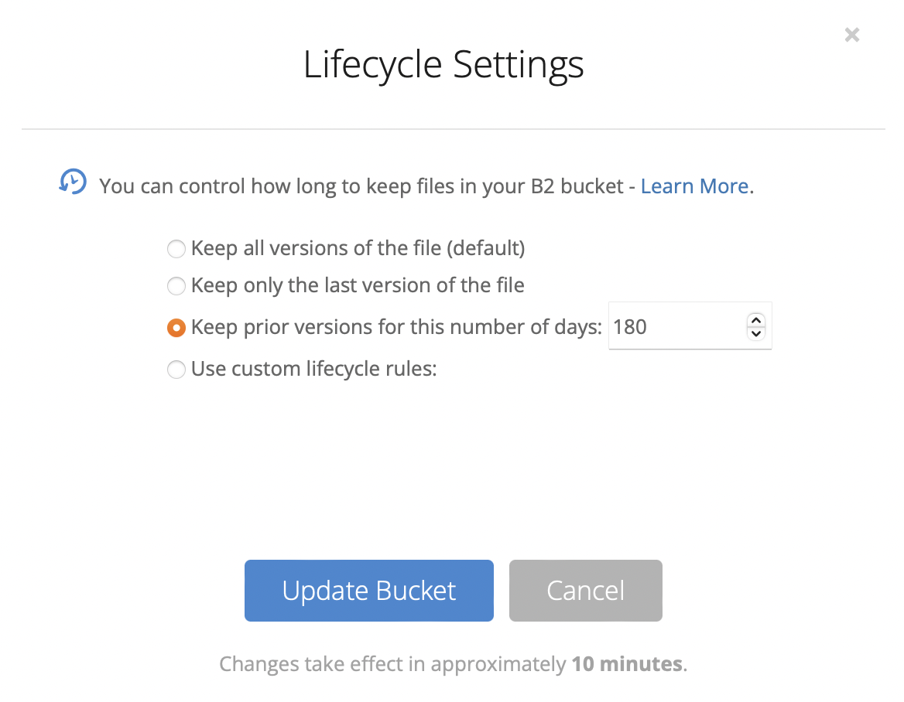
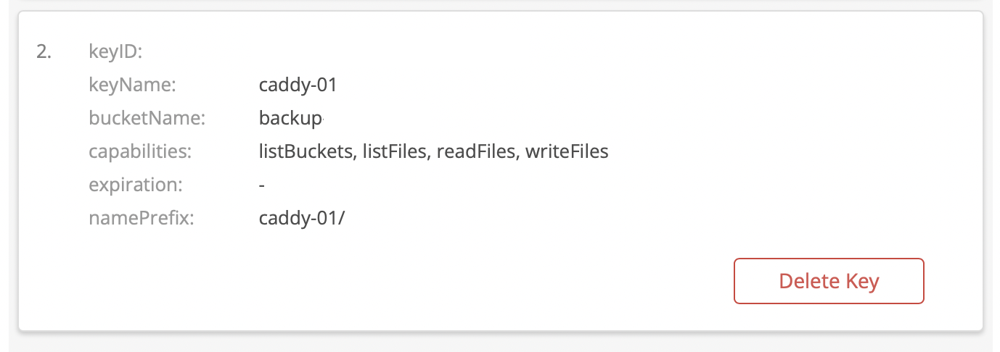

Varmuuskopiot on tunnetusti hyvä olla. Hoksasin ettei minulla ollut
web-palvelimeltani varmuuskopioita, koska "eihän siellä ole mitään tärkeää".
Kuitenkin jos onnistuisin sen tuhoamaan, niin luultavasti kaipaisin juuri sitä
yhtä crontab-tiedostoa jota en ottanut muualle talteen. Niinpä päätin laittaa
varmuuskopiot kuntoon ja ajastaa päivittäisin restic-varmuuskopion Backblazen
B2-pilveen.

<!--more-->

## Varmuuskopioista

Varmuuskopioita varten ensimmäinen tarvittava asia on turvallinen säilö johon
varmuuskopioita voi jemmata. Paras säilö on sellainen joka:

* on luotettava (ei hukkaa tietoja)
* on edullinen
* sallii varmuuskopioiden määrän kasvamisen tarpeiden muuttuessa
* estää tietojen poistamisen vaikka haittaohjelma varastaisi tunnukset
  varmuuskopion kohteesta ja yrittäisi tunnusten avulla poistaa kopiot

Luotettavia palveluntarjoajia on useita. Jos tietoja ei salattaisi, olisi
hyvä huolehtia myös missä maassa tietoja säilytetään, mutta koska lähtökohta
on että varmuuskopiot on salattava niin ettei tallennuspalveluntarjoaja niihin
voi päästä, niin sijainnilla on eniten merkitystä tiedonsiirtonopeuteen.

Kustannusten osalta eri tarjoajilla hinta riippuu usein tallennettavan tiedon
määrästä. Esimerkiksi Microsoft 365:n OneDrive-tallennustila voisi olla tavallaan
edullinen jos palvelusta joka tapauksessa maksaa. Toisaalta tilan määrä on
kiinteä, mikä rajoittaa kasvua.

Varmuuskopiointisovelluksissa on paljon valinnanvaraa. Monet palveluntarjoajat
tarjoavat omat sovelluksensa, eli koko palvelu on yksi kokonaisuus. Itse
päädyin kuitenkin valitsemaan varmuuskopiosovelluksen ja tallennustarjoajan
erikseen erityisesti joustavuuden vuoksi.

Käytän varmuuskopiointiin [restic]-sovellusta, joka löytyy useimmista Linux-jakeluista
ja Mac-käyttäjänä [Homebrew]-paketinhallinnasta. Restic tallentaa varmuuskopiot
arkistoon (repository), joka [on aina salattu]. Arkistoon voi liittää yhden tai
useita salasanoja, joilla varsinainen tietojen salausavain puretaan.

Restic tukee useita tallennustarjoajia suoraan ja [rclone avulla valtavaa määrää][rclone].
Minulle tutuin olisi ollut AWS S3, jonne voi tallentaa tiedostoja pohjattomaan
ämpäriin ja lasku seuraa luottokortilla. S3 on kuitenkin varsin monimutkainen ja
maksaa "S3 One Zone – Infrequent access" asetuksilla $0.01/GB, minkä lisäksi
$0.10/GB kun tietoa haetaan, eli 1 teratavun varmuuskopion palauttaminen maksaisi
huimat $100 + 24 % ALV. Päädyin valitsemaan tarjoajaksi Backblaze B2 palvelun,
joka on ominaisuuksiltaan hieman rajoitetumpi mutta pääosin vastaava kuin S3.
B2:n tallennustila maksaa $0.005/GB (eli $5/TB/kk) ja tietojen palautus $0.01/GB
(eli $10/TB + ALV). Ensimmäiset 10 GB saa käyttöön ilmaiseksi,
mikä helpottaa testaamista sillä luottokorttia ei tarvitse antaa.

Jokaisesta varmuuskopointikerrasta restic tuottaa oman tilavedoksen (snapshot),
joten palautuksessa voi valita miltä hetkeltä tiedot palautetaan. Oletuksena
kaikki versiot säilytetään kunnes toisin pyydetään. Muutokset säilytetään
melko tehokkaasti joten varmuuskopioiden koko riippuu lähinnä siitä kuinka paljon
tietoa on ja kuinka nopeasti se muuttuu.

[restic]: https://restic.readthedocs.io/en/stable/ "Restic Documentation"
[Homebrew]: https://brew.sh "The Missing Package Manager for macOS (or Linux)"
[on aina salattu]: https://restic.readthedocs.io/en/stable/070_encryption.html
[rclone]: https://rclone.org "Rclone syncs your files to cloud storage"

## restic varmuuskopionti estäen tietojen poistaminen

**Aiheesta on kirjoittanut paremmin englanniksi [Joseph Price][price].**

Halusin toteuttaa varmuuskopiot niin, että vaikka palvelimelle tallennetut
tunnukset B2-palveluun kirjoittamista varten varastettaisiin, tietoja ei silti
voisi hävittää.

B2:n käyttöönotto alkaa rekisteröintien jälkeen ämpärin (bucket) luonnilla.
Ämpäriin voi tallentaa rajattoman paljon tiedostoja. Varmuuskopiot luontaisesti
kertyvät, joten aluksi muutan asetuksen että B2:n ei pidä säilyttää vanhoja
tietoja ikuisesti vaan vanhat versiot poistetaan pysyvästi 180 päivän jälkeen.



Huomattavaa on, että elinkaariasetus EI estä tietojen poistamista, vaan nimenomaan
poistaa vanhentuneet tiedostot. B2:ssa on myös Object Lock -toiminto, joka estää
tiedoston poistamisen valitun määrän päiviä tallentamisesta. Huonona puolena tässä
on että päiväraja koskee nimenomaan aikaa tallentamisesta ja koska restic tallentaa
vain muuttuneet tiedot, niin osa varmuuskopiosta voisi jäädä suojan ulkopuolelle.
Lisäksi ominaisuus estää resticin toiminnan koska restic käyttää oletuksena
[b2_delete_file_version] rajapintaa.

[b2_delete_file_version]: https://www.backblaze.com/b2/docs/b2_delete_file_version.html "b2_delete_file_version ohjelmointirajapinta"

Ratkaisu ongelmaan löytyy siitä mitä oikeuksia palvelulle annettaville tunnuksille
annetaan. B2-ämpäriin tarvittavat tunnukset muodostuvat tunnukseta ja salaisuudesta,
joihin liitetään oikeudet. Selainkäyttöliittymästä B2 antaa vain vaihtoehdot luku,
kirjoitus tai luku/kirjoitus, mutta ohjelmointirajapinnan avulla avaimia on mahdollista
luoda tarkoilla oikeuksilla. Palvelimelle pitää antaa varmuuskopiointia varten oikeudet
lukea, kirjoittaa ja listata tiedostoja. Kuitenkin jätän pois oikeuden poistaa versioita,
sillä writeFiles oikeus sisältää oikeuden "piilottaa" tiedostoja, eli korvata ne merkillä
että tiedosto on poistettu. Tällöin vanhat versiot jäävät talteen ja ne voi palauttaa
poistamalla tämä piilotusmerkintä. Tunnukset luodaan komentorivillä:

```bash
b2 create-key caddy-01 listBuckets,readFiles,writeFiles,listFiles \
   --bucket backup-SATUNNAINEN \
   --namePrefix caddy-01/
```

Antamalla ämpärin nimi ja tiedostonimen etuliite, voidaan samaan ämpäriin
tallentaa eri tietokoneilta varmuuskopioita turvallisesti, sillä yksi tietokone
ei pääse sörkkimään toisten varmuuskopioita.



Tämän jälkeen normaalisti ne annettaisiin resticille ympäristömuuttujissa
`B2_APPLICATION_KEY_ID` ja `B2_APPLICATION_KEY`, ja käytettäisiin resticin
sisäänrakennettua b2-tukea. Koska restic ei tue piilotusta poiston asemesta,
pitää käyttää välissä `rclone`-työkalua, jolle voi asettaa tarkempia asetuksia.

Harmillisesti [restic asettaa aina `--b2-hard-delete` asetuksen][rclone-hard-delete],
joten vaikka rclone olisi asetettu käyttämään piilotusta, restic ohjaa sen
kuitenkin poistamaan versiot mikä ei tässä luodulla avaimella siis ole sallittua.
Ratkaisuna tähän on antaa komentorivillä `-o rclone.args="serve restic --stdio"`
mikä ohjaa resticiä käyttämään eri komentoriviä rclonen kutsumiseen ja näin
tottelemaan asetusta olla poistamatta versioita.

Lopulta resticin komentorivi on siis:

```bash
export RESTIC_PASSWORD_FILE=/etc/restic/caddy01.key
export RESTIC_REPOSITORY=rclone:b2:backup-SATUNNAINEN/caddy-01/
restic backup --quiet -o rclone.args="serve restic --stdio" / --one-file-system --exclude-file /etc/restic/exclude-file
restic check  --quiet -o rclone.args="serve restic --stdio"
```

rclone.conf näyttää tältä:
```ini
[b2]
type = b2
account = ...tähän B2_APPLICATION_KEY_ID...
key = ...tähän B2_APPLICATION_KEY...
hard_delete = false
```

Tilan vapauttamiseksi voi käyttää `forget` käskyä, missä asetetaan
kuinka paljon varmuuskopioita säilytään. Lippu `--prune`
poistaa tiedot arkistosta, eli tässä tapauksessa merkitsee ne
piilotetuksi. B2 siivoilee piilotetut tiedostot sitten asetetun
elinkaaren mukaan.

```bash
restic forget \
  -o rclone.args="serve restic --stdio" \
  --keep-daily 7 \
  --keep-weekly 4 \
  --keep-monthly 12 \
  --keep-yearly 3 \
  --prune
```


Itse Backblazen portaaliin kirjautumiseen käytän Googlen
kertakirjautumista, koska se minulla on jo valmiiksi hyvin
suojattu [Googlen Lisäsuojaus-ohjelmalla][google-app]. Siitä ehkä toisella kertaa lisää.

[rclone-hard-delete]: https://restic.readthedocs.io/en/stable/030_preparing_a_new_repo.html#other-services-via-rclone
[google-app]: https://landing.google.com/intl/fi/advancedprotection/
[price]: https://pricey.uk/blog/restic-backups-without-delete/ "Joseph Price: Restic backups to B2 without delete"
