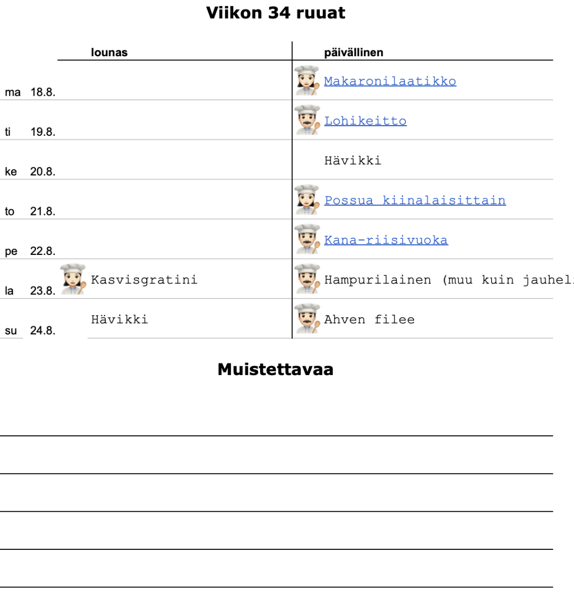
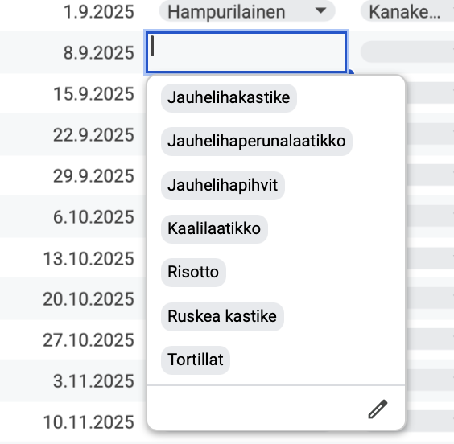
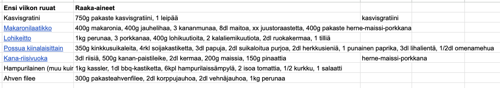

Meidän perheessä kyllästyttiin siihen, kun on niin vaikea keksiä
mitä ruokia valittaisiin. Joku kyselee että mitä sitä voisi tehdä mieli
ensi viikolla, ja toisilla ei tule mitään ajatuksia mieleen.
Alettiin sitten pohtia mikä auttaisi ja päädyttiin tekemään juuri meidän
perheelle sopiva ratkaisu!

<!--more-->

Käytännössä harkittiin kahdesta vaihtoehdosta:

1. Ruokatilauspalvelu

    Meillä on ollut aiemmin kokeilussa palvelu, josta voi tilata viikon
    ruuat resepteineen toimitettuna kotiin. Se oli sinänsä kätevä, mutta
    muutamia ruoka-aineita emme tykkää käyttää joten ne piti aina antaa
    eteenpäin. Sinänsä valmiit ratkaisut tarjoava tilaus on kätevä, ja harkittiin
    sitäkin.

2. Oman kiertävän ruokalistan laatiminen etukäteen

    Sinänsä jo se, että reseptit kopioi tilauspalvelusta sen sijaan että
    ne tilaisi auttaa vähän. Silloin voi hakea kaupasta vain ne mitä tarvii.
    Toisaalta kiertävä ruokalista kuten lounasravintoloissa voisi jo ratkaista
    asian.

💡

Sitten saimme loistavan idean, joka tuntui oikealta. Aloimme heitellä ideoita. Suunnitelma alkoi syntyä.

* Vaihtoehdoista poissuljettaisiin viimeisen parin viikon aikana tehdyt reseptit.
* Reseptit valitaan päivälliseksi koulupäiville, ja viikonlopuille sekä lounas että päivällinen
* Moni ruoka riittää useammaksi kertaa, joten 2 ruokaa onkin "hävikkipäiviä" jolloin sovelletaan siitä mitä jääkaappiin on jäänyt, yleensä edellisen päivän ruokaa lämmittäen.
* Vaihtoehtojen määrää voi vähentää, jos päätetään rutiini että jauhelihaa on vain tiettynä päivänä, kasvisruokaa toisena, keittoa kolmantena, muu kuin nauta parina päivänä, kala tiettynä päivänä.
* Kasvisten määrää ruokavaliossa voisi lisätä valitsemalla enemmän kasvisruokapäiviä.
* Valitsemalla kalaruuan kauppapäivän jälkiselle päivälle, kala on vielä tuoreena.

🫶

Sitten alettiin hahmottelemaan ruokasuunnitelmaa Google Sheets:llä.
Sheets on hyvä, koska se on ilmainen ja siinä on erinomaiset ominaisuudet
yhdessä editoimiseen.

Ensin syntyi jääkaappiin tulostettava ruokalista. Sivulle jää tilaa myös muistiinpanoille.

Sen jälkeen rakennettiin varsinainen työkalu, jolla ruokalista suunnitellaan.

Esimerkiksi maanantai on jauhelihapäivä, jolloin valittavina on vain jauhelihareseptit.

🛒

Ensimmäisen viikon kokeilun jälkeen oli selvää, että tämä
oli ollut loistava ratkaisu. Kyllähän se pari tuntia otti
rakentaa, mutta oli niin palkitsevaa nähdä että ajatus
muuttui todellisuudeksi että tämän rakentaminen oli
oikeastaan hauskaa.

Toisen viikon kauppalistaa tehdessä oli kuitenkin ilmeistä,
että seuraavana ongelmana olisi listata mitä kaikkia
raaka-aineita kaupasta pitää ostaa.
Kun reseptit on taulukossa, niihin on helppo lisätä
tarvittavat raaka-aineet, tai ainakin ne mitä ei voi
olettaa kaapista löytyvän.

Reseptipankin naputtelu on meillä vielä kesken, mutta jos
joka viikko pari reseptiä täyttelee niin lopulta tämäkin
saadaan automatisoitua, eikä joka tapauksessa nytkään
vaadi juuri ajatustyötä.

Lopuksi vain lista täytyy siirtää ruokakaupan
noutotilaukseen. Viikonloppuna ei tarvitse kuin
käydä kaupasta hakemassa tilaus ja samalla voi käydä
kaupasta täydentämässä niillä asioilla, joita
noutotilaukseen ei muistanut laittaa tai jotka haluaa
mieluummin valita itse.

Jatkoon! 👨‍💻

