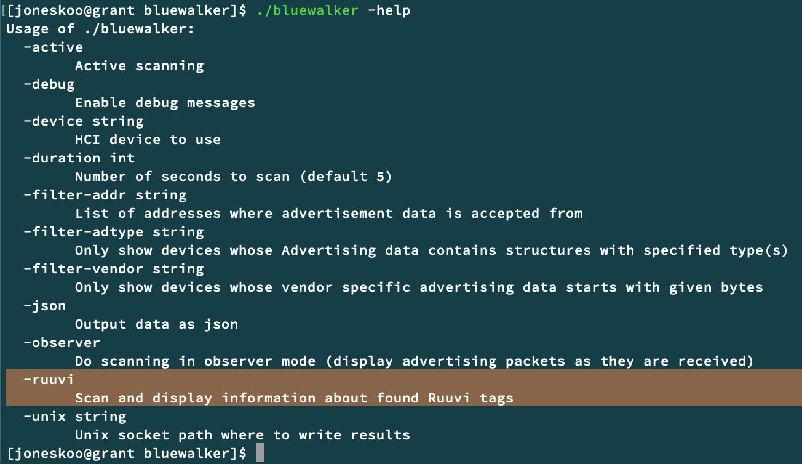
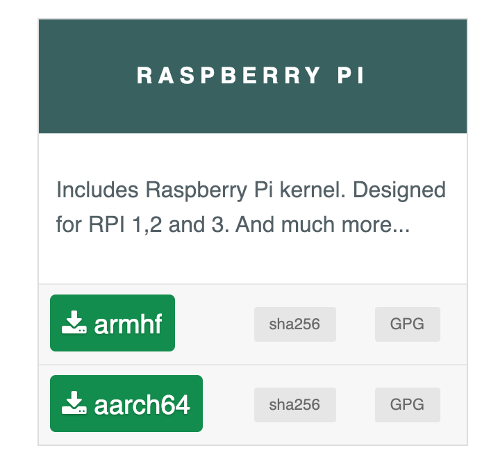
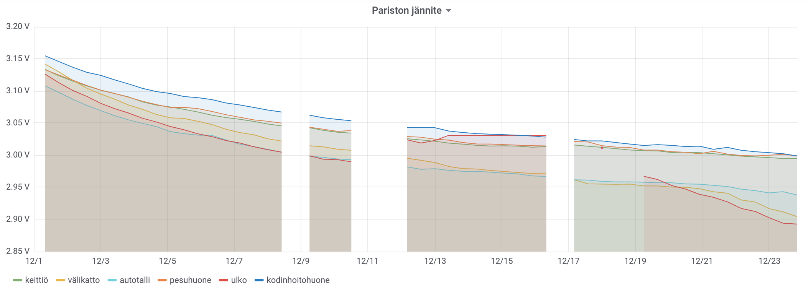

Sain entisen työkaverin blogauksesta ([Oma sääasema RuuviTagilla ja Grafanalla][alatalo]) ajatuksen rakentaa itsellenikin oma sääasema.
Olin aiemminkin lueskellut [Ruuvi][ruuvi] projektista.
Ville Alatalon innoittamana lähdin selvittämään mitä vaatisi
saada oma sääasema. Ihan samoilla teknologioilla en sääasemaa
toteuttanut, mutta perusajatus on sama. Dataa on nyt kertynyt
joulukuun alusta.

<!--more-->

Alunperin
Ruuvi [lähti käyntiin RuuviTracker projektista Kickstarter-joukkorahoituspalvelussa][ruuvi2019].
Kyseisen tuotteen kaupallista versiota saadaan kuitenkin vielä
odotella, mutta sen sijaan Ruuvia kehittävä Ruuvi Innovations Ltd.
on tehnyt RuuviTag-nimisen sensorituotteen.

Helposti netistä löytyvät "viralliset" sovellukset sensoridatan
vastaanottamiseen:

* [Ruuvi Station] (Android nyt ja iOS tulossa)
* [RuuviCollector] (Java / hcidump)
* [ruuvitag-sensor] (Python / hcidump)

Oikeastaan vasta kun sain selvitettyä miten Ruuvi-tagit lähettävät
dataa ja millaisella softalla niitä voi vastaanottaa, päätin
ostaa tagit. Lounaskeskustelun jälkeen ajatus hcidumpiin pohjautuvan
softan käyttämisestä alkoi hirvittää, se kun kuulostaa vastaavan
lähinnä tcpdump + grep -tasoista hirvitystä. Kuitenkin kuulin että
toinen entinen työkaverini Jukka Taimisto on kirjoittanut oman
softansa, joka kuuntelee Bluetooth-viestejä ja erityisesti siinä
on jo valmiina tuki Ruuvi-tagien vastaanottamiseen.
[Bluewalker][bluewalker] on kirjoitettu Go-ohjelmointikielellä ja
se ei käytä ollenkaan hcidumpia vaan avaa suoraan Linuxin HCI-liitynnän
ja alkaa vastaanottamaan Bluetooth-viestejä.

Bluewalker ei kuitenkaan tarjoa suoraa ratkaisua mittausten saamiseen näkyville
esimerkiksi [Grafanaan][grafana], vaikkakin se osaa vain lähettää raa'at
mittaukset omassa formaatissaan eteenpäin. Bluewalkeria ei
varsinaisesti ole tarkoitettu tähän käyttötarkoitukseen.
Koodi oli kuitenkin yksinkertaista ja olin jo aiemmin kokeillut
metriikkadatan tuottamista [Prometheuksella][prometheus] ja tiesin
että lämpötilojen saaminen Prometheukseen olisi helppoa kunhan
pystyn muokkaamaan koodia.

Prometheus sekä kerää datat että toimii tietokantana ja Grafana
osaa piirtää kuvaajia sitä suoraan. Prometheuksen käyttäminen on
varsin helppoa ja siinä ei ole ylimääräisiä vipuja viritettävänä
vaan se lähtee suunnilleen oletusasetuksilla toimimaan.

Omalle ratkaisulleni edellytyksenä oli että saan lämpötilat näkymään
kotipalvelimellani jo pyörivään Grafanaan. RuuviTagien lähettämä
signaali kuitenkin toimii vain rajallisella alueella enkä halunnut
sitoa vastaanottoa kotipalvelimeni sijaintiin, joten
päätin eriyttää tagien vastaanottamisen Raspberry Pi -tietokoneelle.

Päädyin siis toteuttamaan oman sovellukseni [ruuvi-prometheus],
joka yksinkertaisesti lataa [bluewalker] Bluetooth- ja Ruuvi-toteutuksen
ja tarjoaa datan Prometheukselle sopivassa muodossa.
Näin minun ei tarvinut kirjoittaa kovin paljon koodia.
Hieman työläämpi osuus oli tuotteistaa ruuvi-prometheus toimimaan
Raspberry Pi:llä, ja erityisesti kun laitoin vielä vaatimukseksi
että toteutuksen pitää olla vikasietoinen erityisesti vastaanottimen
virtojen irrottelun osalta.

Tavallisin ratkaisu on käyttää Raspbian-käyttöjärjestelmää, joka on
muokattu Debian-jakelu. Sen ongelmana on kuitenkin, että se on
tavallinen Linux-jakelu ja se olettaa että Raspberry Pi:n SD-kortti toimii samalla tavalla kuin Linux olisi asennettu tavallisen
tietokoneen kovalevylle. Tästä seuraa ongelmia, sillä jos virrat
katoavat yhtäkkiä, SD-kortin tiedot saattavat korruptoitua ja korjaamiseksi
kortti voi olla tarpeen kirjoittaa uudestaan.

Itse päädyin toteuttamaan Raspberry Pi:n softan Alpine Linux -jakelun
päälle. Alpine on siitä erilainen että se lataa oletuksena kaiken
muistiin käynnistyksessä. Sen kohde on olla minimalistinen ja
yksinkertainen. Lopputuloksena SD-kortille jäikin vain 72 MB dataa
käyttöjärjestelmän ja oman ruuvi-prometheus Prometheus-kollektorini
kanssa. Raspberry Pi 3 B+ tietokoneella muistia jää vapaaksi n. 890 MB
ja SD-kortille ei siis kirjoiteta mitään. Kortin voi itse asiassa
periaatteessa vaikka irrottaa koneen käynnistyttyä, tosin helpompi
pitää se paikallaan niin virtakatkon jälkeen kone käynnistyy automaattisesti.

Raspberryssä on sisäänrakennettuna WiFi ja Bluetooth LE, joten
mitään ylimääräistä rautaa ei tarvita Raspberry Pi 3B+ lisäksi.
Halvemmalla saman sovelluksen voisi ajaa Raspberry Pi Zero W:lla,
mutta sen saatavuus on huonompi.

Hankaluutena Alpinen kanssa oli tajuta miten "diskless" tila toimii
ja se, että Alpinen mukana ei tule firmware-tiedostoja Broadcomin
WiFi ja Bluetooth-piirisarjoille, joten ne joutuu erikseen hankkimaan
ja laittamaan SD-kortille firmware-hakemistoon. Ilmeisesti Broadcom
ei tarjoa niitä vapaalla lisenssillä, minkä vuoksi Linux-jakelut
eivät niitä laita mukaan. Raspbianissa ne kuitenkin ovat mukana, eli
siitä ne voi kopioida.

Minulla on kuusi RuuviTag sensoria kotona. Olen sijoittanut ne
keittiöön, kodinhoitohuoneeseen, pesuhuoneeseen, autotalliin,
välikatolle ja ulos. Dataa minulla on nyt joulukuun ajalta, paitsi
kun olen säätänyt softaa ja keräily on ollut hetkiä pois päältä.

Mielenkiintoisimmat havainnot ovat olleet pesuhuoneen ilmankosteuden
muutokset saunomisen ja suihkussa käynnin yhteydessä. Yllättävän
kiinnostava on ollut ilmanpaineen seuraaminen, ja erityisesti kun
keksin vähentää piirtää paineen sijasta paine-eron ulkona olevaan
sensoriin, jolloin saan ilmanvaihdon alipaineen. Tämä on auttanut
ymmärtämään asunnon ilmanvaihdon toimintaa ja säätöjä. Lisäksi
siinä missä aiemminkin minulla on ollut pöytämittarissa ilmankosteus,
saman tiedon saaminen kuvaajana koko kuukaudelle useista mittapisteistä
auttaa ymmärtämään mistä ilmankosteus johtuu ja mikä trendi on.

Kuvassa näkyy hyvin miten voimakkaasti saunominen näkyy pesuhuoneen
ilmankosteudessa. Myöhemmin pyykkiä kuivatessa ilmanvaihto on
jäänyt vahingossa väärään asentoon ja ilma ei vaihdu niin kosteus
nousee. Kävin heti korjaamassa kun huomasin tätä kirjoittaessa.

Sensorit hakevat vielä lopullisia paikkojansa, mutta vielä kiinnostaisi lisätä pari sensoria, ainakin autoon ja saunaan.
Pitää vielä harkita ostanko lisää vai siirränkö olemassaolevia.

Tämäkin projekti vahvisti mielipidettäni siitä, että haluan kirjoittaa
jatkossakin kaiken kotona itse kirjoittamani koodin Go-ohjelmointikielellä.
Tarkemmat perustelut jäävät toiseen kertaan.

Jännityksellä seuraan kauanko RuuviTagien patterit kestävät.
Ilmoitettu kesto on 2+ vuotta, mutta se riippuu luonnollisesti
lämpötilasta. Lämpötila vaikuttaa myös ulkomittarien jännitteeseen
olennaisesti.

Seuraavaksi varmaan pitää kehittää miten mittausdata näkyy kotona,
esim. jatkuvasti päivittyvällä säätilaruudulla. Ilmeisestikin jotain
muistutuksia kannattaisi myös virittää esimerkiksi liian matalalle
lämpötilalle (ovi auki?) tai pitkään kohonneelle ilmankosteudelle.

[alatalo]: https://medium.com/@ville.alatalo/oma-s%C3%A4%C3%A4asema-ruuvitagilla-ja-grafanalla-25c823f20a20 (Oma sääasema RuuviTagilla ja Grafanalla - Ville Alatalo)
[ruuvi]: https://ruuvi.com/ (Ruuvi Innovations Ltd)
[ruuvi2019]: https://blog.ruuvi.com/our-year-2018-and-plans-for-2019-b559c33a5791 (Ruuvi: Our Year 2018 and Plans for 2019)
[ruuvitag-sensor]: https://github.com/ttu/ruuvitag-sensor
[RuuviCollector]: https://github.com/Scrin/RuuviCollector
[Ruuvi Station]: https://lab.ruuvi.com/ruuvi-station/
[bluewalker]: https://gitlab.com/jtaimisto/bluewalker/
[grafana]: https://grafana.com/
[prometheus]: https://prometheus.io/
[ruuvi-prometheus]: https://github.com/joneskoo/ruuvi-prometheus
