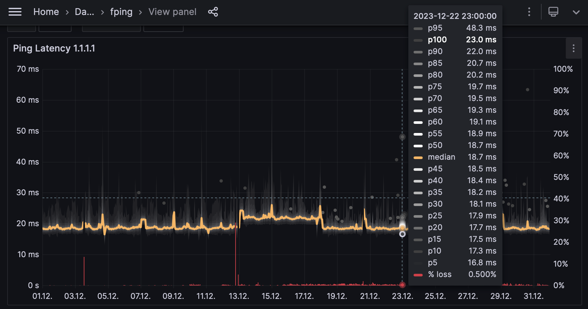
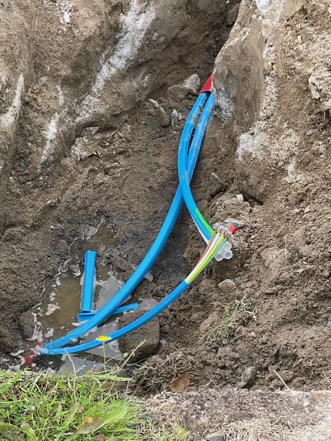
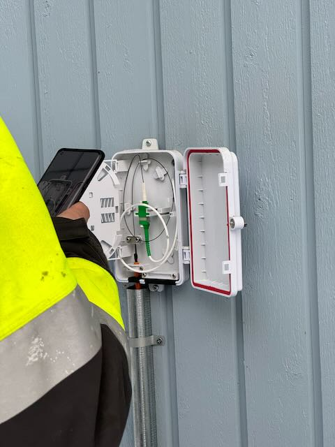
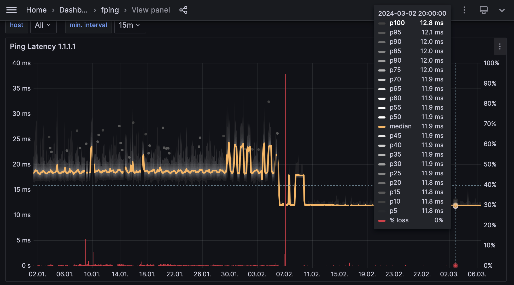
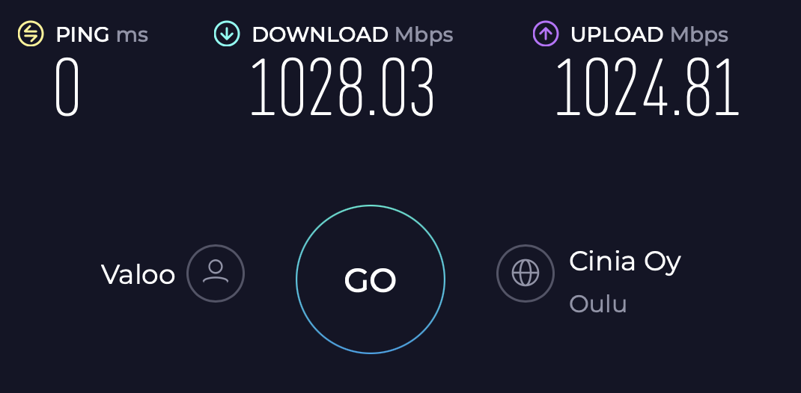

Tässä kirjoituksessa jaan kokemukseni valokuitulaajakaistan tilaamisesta, aktivoinnista ja testaamisesta.

<!--more-->

## Lähtötilanne

Kun ostimme omakotitaloa, minulle yksi vaatimus oli saada vähintään 1 Gbit/s nettiyhteys. Tämä periaatteessa toteutuikin kun DNA:lta sai kaapeli-TV-verkossa 1 Gbit/s alas ja 100 Mbit/s ylös. Aluksi olinkin varsin tyytyväinen yhteyteen, ja varsinkin kun lähtötasona oli 4G-verkon kautta tullut 100 Mbit/s LTE-yhteys.

Kaapeliverkossa aluksi nopudeksi toteutui n. 750-800 Mbit/s alas ja 70-80 Mbit/s ylös. Jostain syystä nämä nopeudet eivät myöhemmin toteutuneet säännöllisesti, varsinkaan parhaaseen katseluaikaan, vaan nopeudet jäivät 400-600 Mbit/s. Tätäkin merkittävämpänä kaapelimodeemiyhteydessä viive on vaihteleva.

Aiempi operaattorini DNA käyttää verkossaan DOCSIS 3.0 -tekniikkaa. Periaatteessa päätelaitteet ovat
uudempia vähintään DOCSIS 3.1 -laitteita, mutta kun keskittimet ovat 3.0 niin uudemmat ominaisuudet jäävät käyttämättä. Erityisesti [Low Latency DOCSIS]
olisi todella merkittävä päivitys, mutta käsittääkseni DNA ei tätä ole syystä
tai toisesta ottanut käyttöön.


> Cable Labs: Low Latency DOCSIS: Technology Overview
>
> TABLE 1. EVOLUTION OF LATENCY PERFORMANCE IN DOCSIS NETWORKS (ROUND-TRIP TIME IN MILLISECONDS BETWEEN THE CM AND CMTS)
 > |                           | DOCSIS 3.0 Early Equipment | DOCSIS 3.0 w/ Buffer Control | DOCSIS 3.1 Active Queue Management | Low Latency DOCSIS 3.1 |
> |---------------------------|---------------------------|-----------------------------|-----------------------------------|-----------------------|
> | When Idle                 | ~10 ms                    | ~10 ms                      | ~10 ms                            | ~1 ms                 |
> | Under Load                | ~1000 ms                  | ~100 ms                     | ~10 ms                            | ~1 ms                 |
> | 99th Percentile           | ~1000 ms                  | ~100 ms                     | ~100 ms                           | ~1 ms                 |

[Low Latency DOCSIS]: https://www.cablelabs.com/technologies/low-latency-docsis


> Vasteaika ja sen vaihteluväli, fping Grafanassa, joulukuu 2023, DNA 400/50M DOCSIS 3.0

Suorituskyky oli näinkin hyvä lähinnä, koska käytin Linux-reitittimessäni
[CAKE-algoritmia], joka jakaa käytettävissä olevan kaistan tasaisesti kaikkien
käyttäjien ja sovellusten kesken. CAKE on noituutta, mutta todella helppo ottaa
käyttöön ja muuttaa dramaattisesti suorituskykyä kun käyttäjiä on useita yhtäaikaa.
Ilman CAKE:a, jos yksi käyttäjä lataa tiedostoa tai lähettää isoa tiedostoa nettiin,
vasteajat nousevat jopa satoihin millisekunteihin ja tämän todellakin huomaa verkkopeleissä,
SSH-pääteyhteydessä tai videokonferenssissa.

```sh
# Uplink shaping
tc qdisc add dev wan0 root cake bandwidth 50Mbit docsis nat
# Downlink shaping
ip link add name ifb4uplink type ifb
tc qdisc add dev wan0 handle ffff: ingress
tc qdisc add dev ifb4uplink root cake bandwidth 385Mbit besteffort wash nat docsis
ip link set ifb4uplink up
tc filter add dev wan0 parent ffff: protocol all prio 10 u32 match u32 0 0 flowid 1:1 action mirred egress redirect dev ifb4uplink
```

Asetuksissa `docsis` kertoo CAKE:lle että liittymä käyttää DOCSIS-kehystystä,
mikä eroaa Ethernetistä. Tämän avulla CAKE osaa laskea paljonko kaistaa todella
kuluu itse kaapelimodeemilinjalla, sillä rajoittava tekijä ei ole Ethernet-linkki
kaapelimodeemille.

Jos DNA tukisi Low Latency DOCSIS:ta, niin tätä ei tarvittaisi vaan homma toimisi
kuten pitää jo kaapelimodeemissa.

[CAKE-algoritmia]: https://www.bufferbloat.net/projects/codel/wiki/Cake/ "Cake - Common Applications Kept Enhanced"

## Tilauksen tekeminen

Sanomattakin selvää, olin erittäin kiinnostunut valokuituyhteydestä. En kuitenkaan
pitänyt todennäköisenä että sellaista tänne saisin. Eräänä päivänä vaimoni Helka
kuitenkin sanoi että oli joko nähnyt Facebookissa tai kuullut työkaverilta, en muista,
että alueella kerätään tilauksia valokuituyhteyksille. Itse asiassa palveluntarjoajia
oli kaksikin: Adola Oy:n Täyskuitu (nyk. Valoo Oy) ja Valokuitunen. Lisäksi muualla
Oulussa yhteyksien rakentamista suunnittelivat Lounea ja GlobalConnect, ei kuitenkaan
meidän alueella.

Vertailin Valoo ja Valokuitunen tuotteita ja päädyin tilaamaan yhteyden Valoo:lta.
Näiden välillä on muutamia eroja. Tässä muistikuvani millä perusteella tein valinnan.

|                   | Valoo                                | Valokuitunen |
| ----------------- | - | - |
| Nopeus            | max. 2 Gbit/s, tulossa 20 Gbit/s     | max. 1 Gbit/s |
| Palveluntarjoaja  | Valoo, sisältyy hintaan.             | avoin verkko, operaattori valittavissa useista vaihtoehdoista |
| Sopimus           | 0 € rakentamiskulut, 24 kk määräaikaisuus | 5 vuoden määräaikaisuus |
| Hinta, aktiivinen 1G liittymä | 49,90€/kk (39,90 €/12kk) | 53,70 €/kk (34,70 €/kk /12kk)|
|                               | + 0 € kuidusta           | + 19,90€/kk kuidusta<br>TAI 2390 € kertamaksu |
| Hinta, irtikytkettynä         | 0 €/kk                        | 4,90 €/kk ylläpitomaksu |


Toisin sanoen, Valoo on samanhintainen toistaiseksi voimassaolevalta hinnalta kuin
DNA:n 24kk tarjoushinta 1G/100M kaapelimodeemille. Valokuitunen on kalliimpi ja
monimutkaisesti hinnoiteltu. Jos liittymää ei pidä aktiivisena, siitä pitää maksaa
ylläpitomaksua.

Näistä lähtökohdista oli ilmeistä että päädyin Valoo:n liittymään.


## Rakentaminen

Parhaiten rakentamisen sujuminen selvenee seuraavalla aikajanalla:

| Päivämäärä |  |
|------------|-----------|
| 2022-06-29 | Tilausvahvistus - Täyskuitu (Adola) |
| 2022-09-19 | Täyskuitu on nyt Valoo Täyskuitu |
| 2022-09-20 | Rakentamisvahvistus Oulu_7 |
| 2023-07-09 | Tonttikaivuu meillä |
| 2023-08-07 | Tiedote Viikko 32/2023<br>*Kaikki rakentamistyöt valmistuvat **15.12.2023 mennessä**. Liittymät ovat valmiina käyttöönotettavaksi pääsääntöisesti jo aikaisemmin, ajankohta tarkentuu töiden edetessä.* [Valoo - Oulu 7 rakentamistiedotteet] |
| 2023-09-05 | Runkokaivuu meidän tiellä |
| 2023-10-09 | Tiedote Viikko 41/2023 *Runkorakentaminen alueella valmis.* |
| 2023-10-30 | Tiedote Viikko 43/2023 *Saapuneiden talviolosuhteiden vuoksi alueen maanrakentamistyöt on keskeytetty tältä rakentamiskaudelta* |
| 2023-11-02 | Asentajat kävivät dokumentoimassa asennuksen (eli puhallus tapahtunut joskus aiemmin). |
| 2023-12-15 | **Luvattu valmistuminen** tiedotteen 2023-08-07 perusteella… ei toteutunut. |
| 2024-02-02 | Laitoin [iotech-foorumilla viestiä että PON valo vilkkuu](https://bbs.io-tech.fi/threads/suomi-kuituyhteyksien-kehitysmaa.8995/post-14315985), ei enää ALARM kuten tähän asti |
| 2024-02-05 | Valoo edustaja laittoi yksityisviestin foorumilla ja lupasi auttaa. 1h myöhemmin yhteys toimi. |
| 2024-02-06 | Irtisanoin aiemman DNA liittymän päättymään kuun loppuun ja pistin modeemin arkistoon. |
| 2024-02-07 | *Käyttöönotot käynnistyneet alueella. Asiakkaille tiedotetaan sähköpostitse ja tekstiviestillä kun liittymä on valmis käyttöönotettavaksi.* |
| (2024?)    | Vaihtoehtoiset operaattorit tarjolle? |

[Valoo - Oulu 7 rakentamistiedotteet]: https://www.valoo.fi/oulu-7/

Joku voisi sanoa että seurasin rakentamista aktiivisesti. Malttamattomasti? Pakkomielteisesti? No, joka tapauksessa innokkaasti.
Ekan kaivurin nähtyäni kävin noin kerran päivässä pyöräilemässä oman alueeni läpi ja kirjasin karttaan missä
on siihen mennessä kaivettu, arvioin missä keskus on, mistä sinne tulee syöttö jne.

Oli miten oli, minulla oli varsin tarkka käsitys milloin puuttui pelkät kuidun
puhallukset ja aktiivilaitteiden asennukset.


> Mikrokanavaputkea kuituverkon rungossa

<center><font size="+4">ALARM 🔴</font></center>

Lopulta kun olin nähnyt että kuitu oli puhallettu, alkoikin sitten varsinainen
odotus. Mikä päivä kuitupurkkiin virrat laittaessa ei enää syttyisikään
virhevalo ALARM merkiksi siitä että valoa ei tule?


> Kuitu puhallettu talon seinälle 2023-11-02

Eräänä päivänä sitten tapahtui ihme ja ALARM ei syttynytkään! Sen sijaan [PON-valo
vilkutti](https://bbs.io-tech.fi/threads/suomi-kuituyhteyksien-kehitysmaa.8995/post-14315985). Mitä ihmettä?
Olin löytänyt osoitteen päätelaitteen konfigurointisivulle, ja selvittänyt oletussalasanan,
minkä avulla pääsin näkemään maagisen tekstin: **Fiber optical power -18,7 dBm**.
Googlettamisen perusteella syy on, että kuitu on kyllä kytketty, mutta verkon päästä
asetukset puuttuvat. Tämä siis perjantaina.

<style>
.blinker {
  animation: blinker 2s infinite;
}

@keyframes blinker {
  0% {
    opacity: 0;
  }
  50% {
    opacity: 1;
  }
  100% {
    opacity: 0;
  }
}
</style>

<center><font size="+4">PON <span class="blinker">🟢</span></font></center>

Seuraavan viikon maanantaina sain illalla yllättävän sähköpostiviestin.
Yksityisviesti foorumilla? Mitä ihmettä. Avasin viestin. Viestin oli lähettänyt
Valoo:n työntekijä.

> Hei,
>
> luin äsken viestisi keskustelupalstalta, jossa kerroit, että PON-valo vilkuttaa. Voisin auttaa saamaan liittymän toimintaan.
>
> Voisitko laittaa sähköpostilla katuosoitteesi osoitteeseen asiakaspalvelu@valoo.fi ja cc:ksi minut …\@valoo.fi.
>
> Terveisin,
> …

Vajaa tuntia myöhemmin, 2024-02-05 21:51 laitoin pyydetyt tiedot, ja klo 22:26 yhteys olikin
jo testattu ja lähetin kiitokset avusta.

<center><font size="+4">PON 🟢</font></center>

<center><font size="+4">🎉</font></center>

Ollaan sittemmin vaihdettu puolin ja toisin viestejä vielä myöhemminkin,
mikä ehkä kertoo että molemmissa päissä on verkosta erittäin kiinnostunut ja
asialle omistautunut henkilö.

<center><font size="+4">🧑‍💻</font></center>

## Testaus

No onko valokuitu ollut sitten niin hyvä kuin odotin? Odotukset olivat korkealla!

**Kyllä. 👍**

No, voinko tehdä jotain mitä en voinut tehdä aiemmin kaapelimodeemiyhteydellä?
Ee, en kyllä voi väittää että mitään olisi varsinaisesti jäänyt tekemättä aiemminkaan.
Kuitenkin, valokuidun yhteyden tasalaatuisuus on kyllä aivan totta.


> fping viiveen vaihteluväli vuoden 2024 aikana

⏱️

Yllä olevassa kuvassa näkyy keltaisella keskimääräinen (mediaani)viive.
Harmaan sävyillä puolestaan näkyy vaihteluväli. p95 tarkoittaa että 95%
mitatuista arvoista on alle arvon 12,1 ms viiveen (Oulusta Helsinkiin ja takaisin).
Jos keskiarvo on 11,9 ms, voidaan todeta että vaihtelua ei käytännössä ole. Huonoinkin
mitattu viive on 12,8ms eli alle 1 ms ero. Toiseen, Oulussa olevaan kohteeseen,
mitattuna viive on nyt 0,898 ms ja p95 1,09 ms. Ilmeisesti PON-tekniikasta johtuu
että aivan nollan lähelle viive ei pääse, toisin kuin parissa muussa kohteessa
missä valokuituyhteys on toteutettu eri tavoin. 1 ms on joka tapauksessa aivan
erinomainen viive ja sen ollessa erittäin vakaa, käytännössä tästä eteenpäin ainoat erot syntyvät
siinä millaiset yhteydet muihin verkkoihin operaattorilla on.

💥

Punainen väri taas kertoo paketeista, joihin ei tullut vastausta. Nämä aiheuttavat
tökkimistä ja pätkimistä varsinkin puheluissa ja verkkopeleissä puhumattakaan
pelistriimaamisesta. Pystyviivana näkyvää ilmoitettua huoltokatkoa lukuunottamatta,
valokuituun vaihtamisen jälkeen kadonneet paketit ovat käytännössä loppuneet.

**Nopeustestit**

Minulla on siis Valoo Netti L 1000M/1000M.

Reitittimenä on [UniFi Dream Machine Special Edition], ja Valoo:n [Nokia XS-010X-Q]
kuitumuunnin on kiinni sen 2.5 Gbase-T WAN-portissa. Sisäverkon 2.5 Gbase-T-kytkin puolestaan
on kiinni 10 Gbit/s SFP+ -portissa Direct Attach -kaapelilla.
Läppäriä varten on kuitenkin edullinen USB-C 2.5 Gbit/s -verkkokortti. Talon sisäkaapelointi
on CAT6A, joten myöhemmin sisäverkon voi päivittää 10 Gbit/s asti.

Harmillisesti WiFi-tukiasema
on toistaiseksi kiinni UDM-SE:n 1Gbase-T PoE+ -portissa, koska siitä saa sähköt samaa verkkojohtoa
pitkin, joten WiFi6E / WiFi 7:n mahdollistamat nopeudet jäävät hyödyntämättä ja WiFi:n kautta
nopeus jääkin n. 800 Mbit/s samassa tai viereisesssä huoneessa tukiaseman kanssa.


> Speedtest 1028 Mbit/s lataus ja 1024 Mbit/s lähetys

| Palvelin    | Lataus | Lähetys | Viive |
| --          | ------ | --------| ------|
| Oulu, Cinia | 1028 Mbit/s | 1024 Mbit/s | 0 ms |
| Helsinki, Valoo | 1004 Mbit/s | 1004 Mbit/s | 11 ms |
| Helsinki, DNA | 1019 Mbit/s | 1018 Mbit/s | 12 ms |
| Tallinna, Tele2 | 1014 Mbit/s | 965 Mbit/s  | 25 ms |
| Amsterdam, RETN | 1005 Mbit/s | 900 Mbit/s  | 40 ms |
| Dublin, Vodafone IE | 115 Mbit/s | 723 Mbit/s | 56 ms |
| London, UK Dedicated Servers | 924 Mbit/s | 716 Mbit/s | 58 ms |

[Luvatut nopeudet liittymälle](https://www.valoo.fi/wp-content/uploads/2023/12/Valoo-laajakaistaliittymien-palvelukuvaus-12_2023-.pdf) ovat:

| Nopeusluokka   | | Latausnopeudet  | Lähetysnopeudet |
| - |- | - | - |
| **L 1000M/1000M**  | Minimi<br>Normaali<br>Maksimi | 400<br>900<br>1000<br> | 400<br>900<br>1000  |
| XL 2000M/2000M  | Minimi<br>Normaali<br>Maksimi | 800<br>1800<br>2000<br> | 800<br>1800<br>2000  |
| XL 20000M/20000M  | Minimi<br>Normaali<br>Maksimi | 8000<br>18000<br>20000<br> | 8000<br>18000<br>20000  |

Aika helposti voidaan todeta että luvatut nopeudet toteutuvat.
En ole kuukauden satunnaisen testailun myötä kertaakaan mitannut DNA:n palvelimelta
alle 1000 Mbit/s nopeutta.

Huomattavaa on, että 1 Gbit/s Ethernet (1Gbase-T) ei mahdollista tällaisia nopeuksia.
Kuitenkin Valoo:n verkko on rakennettu [XGS-PON]-tekniikalla, joka mahdollistaa aikajaetun
"10 Gbit/s" yhteyden. Todellisuudessa eri syistä nopeus ei ole 10 Gbit/s, mutta samapa tuo,
kun suurin nopeusluokka tällä tekniikalla on 2 Gbit/s. Joka tapauksessa jos haluaa saada
XGS-PON-liittymästä suurimman mahdollisen nopeuden 1G-liittymällä, tarvii omien laitteiden
tukea vähintään 2.5 Gbit/s Ethernetiä.

PON-verkko mahdollistaa, ja selvästi Valoo on sen näin suunnitellut, että myöhemmin
samaan valokuituun lisätään 25G-PON tai 50G-PON. Näiden avulla voidaan tuoda tarjolle
nuo lupaillut 20 Gbit/s yhteydet.

[XGS-PON]: https://en.wikipedia.org/wiki/10G-PON "Wikipedia: 10G-PON"
[UniFi Dream Machine Special Edition]: https://eu.store.ui.com/eu/en/pro/category/all-unifi-cloud-gateways/products/udm-se
[Nokia XS-010X-Q]: https://www.al-enterprise.com/-/media/assets/internet/documents/nokia-ont-xs-010x-q-datasheet-en.pdf

Tailscale netcheck

```
	* DERP latency:
		- hel: 13.5ms  (Helsinki, Hetzner)
		- ams: 36ms    (Amsterdam)
		- fra: 43.7ms  (Frankfurt)
		- lhr: 48.1ms  (London)
		- waw: 50.2ms  (Warsaw)
		- par: 55ms    (Paris)
		- mad: 65.7ms  (Madrid)
		- nyc: 116.3ms (New York City)
		- tor: 126.4ms (Toronto)
		- ord: 136ms   (Chicago)
		- mia: 142ms   (Miami)
		- dfw: 149.6ms (Dallas)
		- dbi: 154.1ms (Dubai)
		- den: 154.8ms (Denver)
		- blr: 166.8ms (Bangalore)
		- lax: 171.1ms (Los Angeles)
		- sfo: 178.2ms (San Francisco)
		- sea: 187.8ms (Seattle)
		- sin: 202.5ms (Singapore)
		- jnb: 203.3ms (Johannesburg)
		- nai: 203.9ms (Nairobi)
		- hnl: 224.9ms (Honolulu)
		- sao: 226.3ms (São Paulo)
		- syd:         (Sydney)
		- tok:         (Tokyo)
		- hkg:         (Hong Kong)
```

**Huonot puolet**

Selvästi Valoo:n yhteydet Internetiin
ovat parhaimmillaan erinomaiset, mutta vaihtelua on paljon. Onkin isoja eroja mistä
tietoa lataa ja minkä operaattorien kautta yhteys kulkee. En ole huomannut mitään
varsinaisesti huonoa, mutta ihan selvästi operaattorina Valoo:n yhteydet eivät
tällä hetkellä ole huippuluokkaa. Myös latausnopeudet ulkomailta, ja tietyistä
kohteista Suomestakin, jäävät paikoin 200 Mbit/s luokkaan, mikä ei käytännössä ole
ongelma, mutta uskoisin että kun vaihtoehtoisia palveluntarjoajia tulee käytettäväksi,
kilpailu korjaa tämän ongelman. Itse teknisessä "last mile" yhteydessä en keksi
valittamista, mutta perinteisesssä ISP/palveluntarjoajapuolessa on vielä tilaa
parantaa.

Toisaalta Valoo on myös uusi operaattori, sillä irtautuminen Cinia:n verkosta
omaksi operaattoriksi ja FICIX-yhdysliikennepisteeseeen liittyminen on tapahtunut
vasta viime vuonna ja yhteyksien terminointi Oulussa ja liikennöinti FICIX3-yhdysliikennepisteen
kautta on alkanut vasta maaliskuussa. Toivoa siis sopiikin, että myös itsenäisenä
operaattorina toimiessa kehitystä on lupa odottaa.

<center><font size="+4">🤞</font></center>

